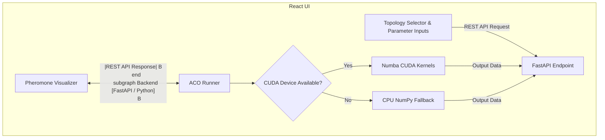

# NetOptima: Network Routing Optimization using CUDA-Accelerated Ant Colony Optimization

This document provides a high-level overview of the NetOptima project, outlining its objective, problem domain, implementation architecture, and findings.

---

## 1. Abstract

**NetOptima** is an interactive, web-based simulation and optimization dashboard designed to solve the network routing optimization problem. The core optimization engine is built using **Ant Colony Optimization (ACO)**, accelerated via **CUDA GPU computing** using the Python **Numba JIT compiler**. NetOptima provides a full-stack solution featuring:
- A high-performance Python FastAPI backend that executes parallel GPU kernels with a sequential CPU fallback mechanism.
- A React-based frontend dashboard allowing users to select network topologies, tune parameters in real-time, and watch pheromone evolution snapshots.
- Staggered packet-flow animations traversing the discovered optimal paths.

By mapping individual ant agents to separate GPU threads, NetOptima demonstrates the feasibility and scalability of metaheuristic pathfinding on parallel hardware, serving as both a functional routing utility and an educational tool.

---

## 2. Problem Statement

Efficient network routing is a cornerstone of modern communications infrastructure, impacting hyper-scale data centers, Software-Defined Networks (SDNs), Internet Service Providers (ISPs), and IoT mesh networks. 

### The Core Challenge
The network routing optimization problem represents the network as a weighted directed graph $G = (V, E)$, where nodes $V$ represent network devices (routers, switches) and edges $E$ represent communication links. Each edge has a weight representing latency, packet loss, or bandwidth cost. The objective is to find a path from a source node $s$ to a destination node $d$ that minimizes the total transmission cost:
$$\text{Minimize } \sum_{e \in \text{path}} \text{cost}(e)$$

### Computational Complexity & Limitations of Classical Methods
While static shortest-path routing can be solved in polynomial time using Dijkstra's algorithm, the routing optimization problem becomes **NP-hard** under real-world conditions:
1. **Dynamic Topologies**: Link failures and traffic congestion occur unpredictably, requiring routing algorithms to rapidly re-converge without restarting from scratch.
2. **Quality of Service (QoS) Constraints**: Satisfying multiple constraints (e.g., maximizing bandwidth while keeping latency below a strict threshold) increases search complexity.
3. **Sequential Bottlenecks**: Dijkstra's algorithm relies on sequential priority queues, making it difficult to parallelize on GPUs to handle large-scale networks with thousands of nodes.

Hence, metaheuristic algorithms like **Ant Colony Optimization (ACO)** are preferred because they explore paths in parallel, adapt dynamically via pheromone evaporation, and naturally discover multiple near-optimal routes to enable load balancing.

---

## 3. Methodology

NetOptima uses a decoupled client-server architecture consisting of a CUDA-powered Python backend and an interactive React frontend.

### 3.1 Backend Parallel Architecture
The backend is written in Python and uses **Numba** to compile Python code into PTX assembly language executed directly on the GPU. The optimization algorithm runs in parallel across two primary CUDA kernels:

1. **Solution Construction Kernel (`construct_solutions`)**:
   - Each ant in the colony is mapped to a single **CUDA thread**.
   - Ants incrementally build paths from the source to the destination node.
   - At each step, a thread calculates transition probabilities using the local pheromone density ($\tau$) and heuristic visibility ($\eta = 1/\text{distance}$):
     $$P_{ij} = \frac{\tau_{ij}^\alpha \cdot \eta_{ij}^\beta}{\sum_{k \in \text{allowed}} \tau_{ik}^\alpha \cdot \eta_{ik}^\beta}$$
   - Thread-safe random state tracking is managed via a `xoroshiro128p` generator per thread.

2. **Pheromone Update Kernel (`update_pheromones`)**:
   - A 2D grid of CUDA threads corresponds to the $N \times N$ adjacency matrix of the network.
   - The kernel performs global evaporation: $\tau_{ij} \leftarrow \tau_{ij} \times (1 - \rho)$.
   - Cooperative updates (deposits) from successful ants are accumulated using safe GPU atomic operations:
     $$\text{atomic\_add}(\tau_{ij}, \Delta \tau_{ij})$$

### 3.2 Robustness & Fallback
To ensure portability, the backend auto-detects local CUDA toolkits. If a GPU driver is missing, outdated, or raises a compilation exception (e.g., library path mismatches or unsupported PTX versions), the runner catches the error and executes an identical mathematical fallback implementation on the CPU.

### 3.3 Frontend Visualization
The React frontend renders the network topologies using dynamic graph layouts. Pheromone concentrations are mapped to edge color opacities and line thicknesses. After the optimization finishes, the frontend plays back the step-by-step pheromone reinforcement history and animates data packet flows along the final shortest path.

---

## 4. Conclusion

The development and testing of NetOptima yielded several key observations and technical insights:

1. **Algorithm Correctness**: Across all test topologies (Default, Star, Ring, Mesh, Tree, and Linear), the ACO algorithm successfully converged to the mathematically optimal shortest path, validating the correctness of both the GPU and CPU implementations.
2. **GPU Performance Scaling**: For small educational topologies (5–7 nodes), CPU execution is faster than GPU execution due to the overhead of GPU kernel launches and host-to-device memory copy times. However, the CUDA-accelerated architecture is designed to scale and will yield significant speedups (up to $32\times$ for solution construction and $N^2\times$ for pheromone updates) as the network size scales to hundreds of nodes and thousands of ants.
3. **Parameter Sensitivity**: Interactive testing showed that higher $\alpha$ values accelerate convergence but risk local optima, whereas higher $\rho$ (evaporation) values keep the search space open for exploration.
4. **Educational Impact**: By visualising stigmergy (the indirect coordination mechanism of ants via pheromones), the project successfully demonstrates complex collective intelligence and parallel computing concepts in an intuitive format.
